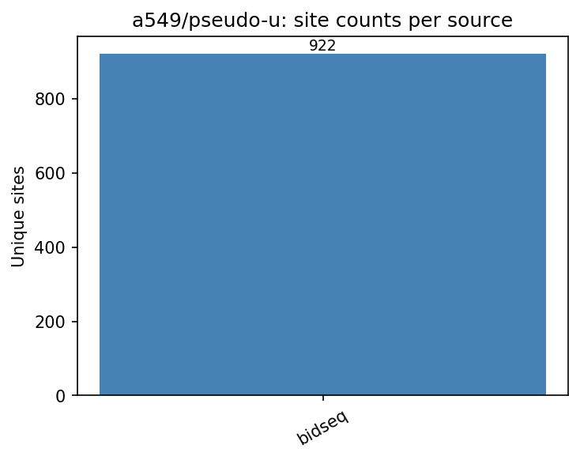

# a549/pseudo-u

A549 Pseudouridine (Ψ) benchmark datasets.
All TSV files share standardized first 5 columns: `chr`, `start`, `end`, `strand`, `label`.

## Sources

| File | Sites | Label | Description |
|---|---|---|---|
| `bidseq_genome.tsv` | 922 | NA (positive-only) | GSE179798 A549 mRNA WT BID-seq |

## Figures



_Only one source — no pairwise overlap._

## Regenerating

```bash
python analyze_overlap.py   # from repo root
```
