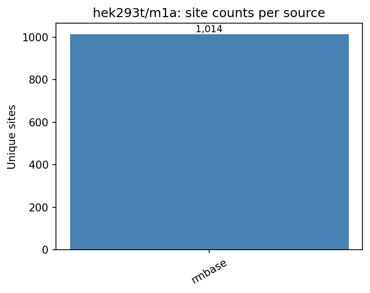

# hek293t/m1a

HEK293T N1-methyladenosine (m1A) benchmark datasets.
All TSV files share standardized first 5 columns: `chr`, `start`, `end`, `strand`, `label`.

## Sources

| File | Sites | Label | Description |
|---|---|---|---|
| `rmbase_genome.tsv` | 1,014 | NA (positive-only) | RMBase v3 HEK293T-filtered m1A sites |

## Figures



_Only one source — no pairwise overlap._

## Regenerating

```bash
python analyze_overlap.py   # from repo root
```
