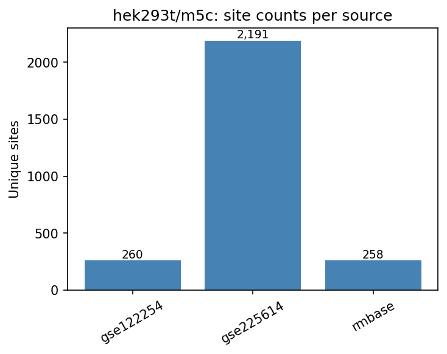
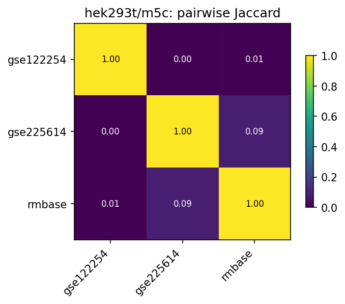
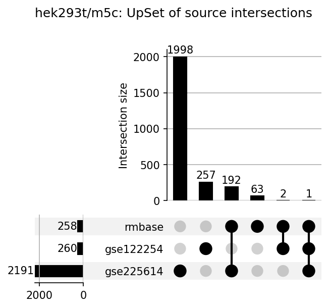

# hek293t/m5c

HEK293T 5-methylcytosine (m5C) benchmark datasets.
All TSV files share standardized first 5 columns: `chr`, `start`, `end`, `strand`, `label`.

## Sources

| File | Sites | Label | Description |
|---|---|---|---|
| `gse122254_genome.tsv` | 260 | `if m5C site` → 0/1 | GSE122254 HEK293T m5C |
| `gse225614_genome.tsv` | 2,191 | NA (positive-only) | GSE225614 HEK293T-WT sites (rRNA dropped) |
| `rmbase_genome.tsv` | 258 | NA (positive-only) | RMBase v3 HEK293T-filtered m5C sites |

## Figures







## Pairwise overlap

Site key: `(chr, start, end, strand)`. Jaccard = |A ∩ B| / |A ∪ B|.

| A | B | A∩B | Jaccard | A∩B/A | A∩B/B |
|---|---|---|---|---|---|
| gse122254 | gse225614 | 1 | 0.0004 | 0.004 | 0.000 |
| gse122254 | rmbase | 3 | 0.0058 | 0.012 | 0.012 |
| gse225614 | rmbase | 193 | 0.0855 | 0.088 | 0.748 |

## Regenerating

```bash
python analyze_overlap.py   # from repo root
```
