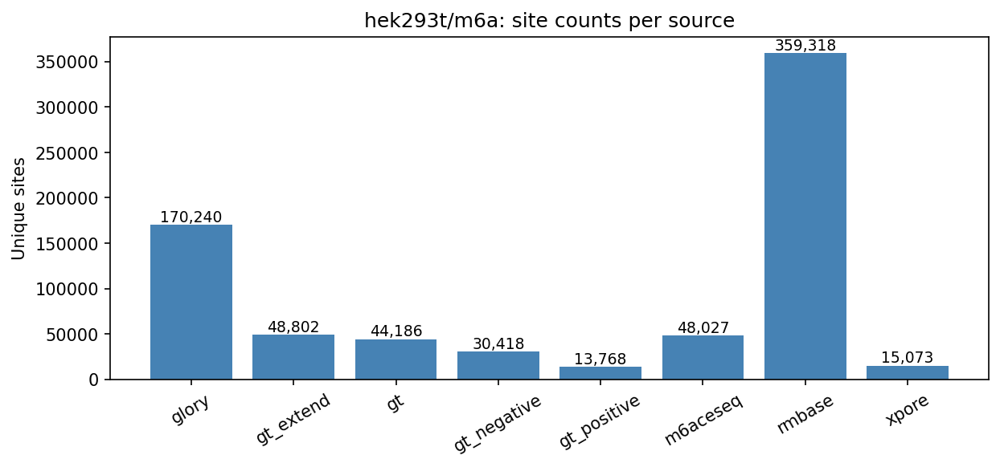
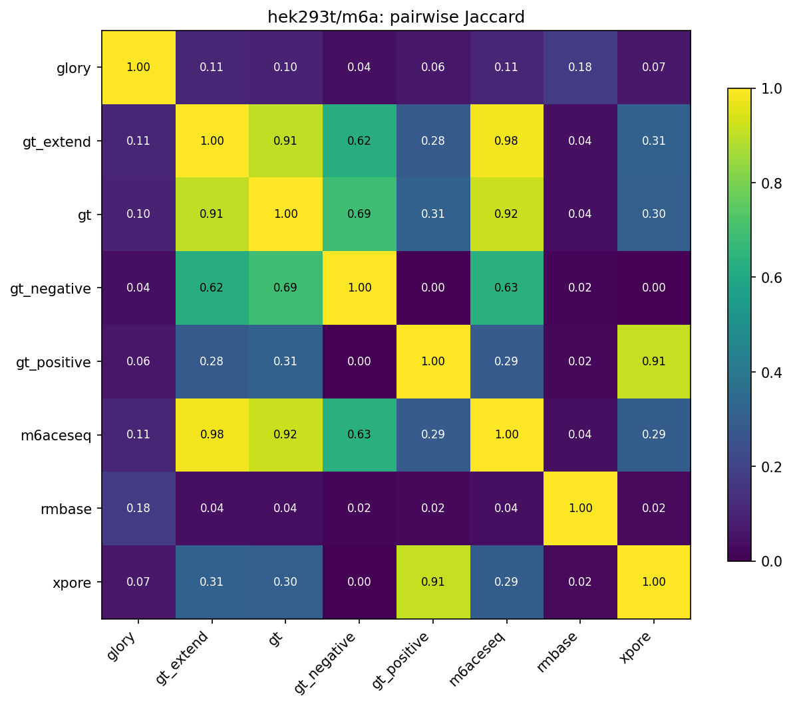
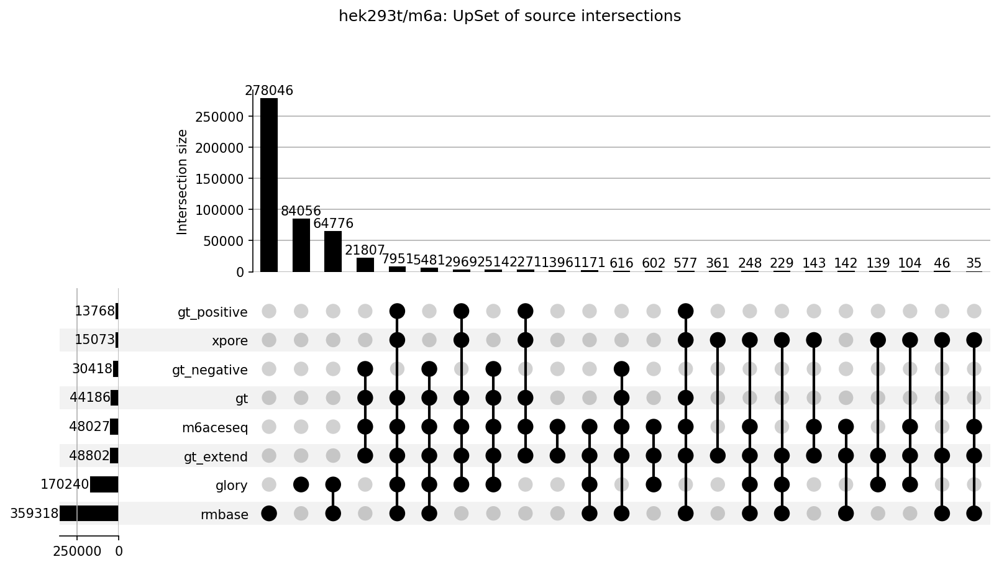

# hek293t/m6a

HEK293T N6-methyladenosine (m6A) benchmark datasets.
All TSV files share standardized first 5 columns: `chr`, `start`, `end`, `strand`, `label`.

## Sources

| File | Sites | Label | Description |
|---|---|---|---|
| `glory_genome.tsv` | 170,240 | NA (positive-only) | GLORY cluster annotations |
| `gt_extend_genome.tsv` | 48,802 | mettl3-m6a (0/1) | Extended ground-truth (gt ∪ m6ACE-seq) |
| `gt_genome.tsv` | 44,186 | mettl3-m6a (0/1) | Consensus ground-truth derived from m6ACE-seq + xPore |
| `gt_negative_genome.tsv` | 30,418 | mettl3-m6a = 0 | gt negatives only |
| `gt_positive_genome.tsv` | 13,768 | mettl3-m6a = 1 | gt positives only |
| `m6aceseq_genome.tsv` | 48,027 | WT/KO RML ratio ≥ 4 → 1 else 0 | m6ACE-seq (raw, author supplementary) |
| `rmbase_genome.tsv` | 359,318 | NA (positive-only) | RMBase v3 HEK293T-filtered m6A sites |
| `xpore_genome.tsv` | 15,073 | WT/KO RML ratio ≥ 4 → 1 else 0 | Paper supplementary 4 / xPore zenodo |

## Figures







## Pairwise overlap

Site key: `(chr, start, end, strand)`. Jaccard = |A ∩ B| / |A ∪ B|.

| A | B | |A∩B| | Jaccard | |A∩B|/|A| | |A∩B|/|B| |
|---|---|---|---|---|---|
| glory | gt_extend | 21,408 | 0.1083 | 0.126 | 0.439 |
| glory | gt | 18,915 | 0.0967 | 0.111 | 0.428 |
| glory | gt_negative | 7,995 | 0.0415 | 0.047 | 0.263 |
| glory | gt_positive | 10,920 | 0.0631 | 0.064 | 0.793 |
| glory | m6aceseq | 21,040 | 0.1067 | 0.124 | 0.438 |
| glory | rmbase | 79,856 | 0.1776 | 0.469 | 0.222 |
| glory | xpore | 11,640 | 0.0670 | 0.068 | 0.772 |
| gt_extend | gt | 44,186 | 0.9054 | 0.905 | 1.000 |
| gt_extend | gt_negative | 30,418 | 0.6233 | 0.623 | 1.000 |
| gt_extend | gt_positive | 13,768 | 0.2821 | 0.282 | 1.000 |
| gt_extend | m6aceseq | 48,027 | 0.9841 | 0.984 | 1.000 |
| gt_extend | rmbase | 16,496 | 0.0421 | 0.338 | 0.046 |
| gt_extend | xpore | 15,073 | 0.3089 | 0.309 | 1.000 |
| gt | gt_negative | 30,418 | 0.6884 | 0.688 | 1.000 |
| gt | gt_positive | 13,768 | 0.3116 | 0.312 | 1.000 |
| gt | m6aceseq | 44,186 | 0.9200 | 1.000 | 0.920 |
| gt | rmbase | 14,625 | 0.0376 | 0.331 | 0.041 |
| gt | xpore | 13,768 | 0.3027 | 0.312 | 0.913 |
| gt_negative | gt_positive | 0 | 0.0000 | 0.000 | 0.000 |
| gt_negative | m6aceseq | 30,418 | 0.6334 | 1.000 | 0.633 |
| gt_negative | rmbase | 6,097 | 0.0159 | 0.200 | 0.017 |
| gt_negative | xpore | 0 | 0.0000 | 0.000 | 0.000 |
| gt_positive | m6aceseq | 13,768 | 0.2867 | 1.000 | 0.287 |
| gt_positive | rmbase | 8,528 | 0.0234 | 0.619 | 0.024 |
| gt_positive | xpore | 13,768 | 0.9134 | 1.000 | 0.913 |
| m6aceseq | rmbase | 16,221 | 0.0415 | 0.338 | 0.045 |
| m6aceseq | xpore | 14,298 | 0.2930 | 0.298 | 0.949 |
| rmbase | xpore | 9,086 | 0.0249 | 0.025 | 0.603 |

## Regenerating

```bash
python analyze_overlap.py   # from repo root
```
