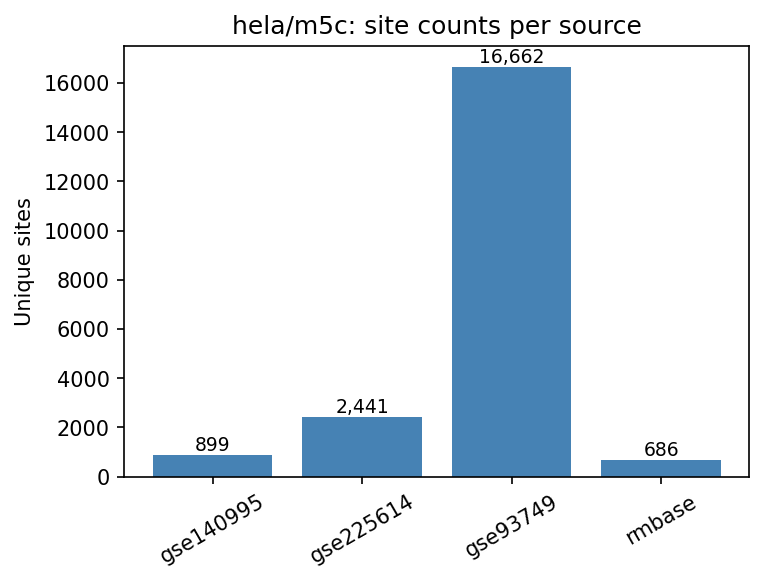
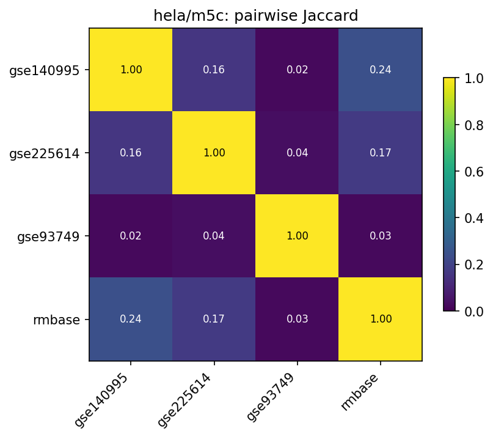
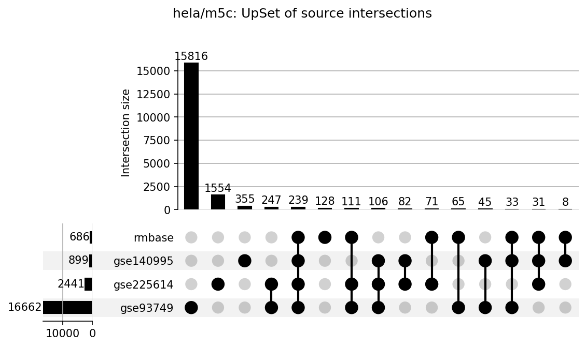

# hela/m5c

HELA 5-methylcytosine (m5C) benchmark datasets.
All TSV files share standardized first 5 columns: `chr`, `start`, `end`, `strand`, `label`.

## Sources

| File | Sites | Label | Description |
|---|---|---|---|
| `gse140995_genome.tsv` | 899 | NA (positive-only) | GSE140995 transcriptome-wide m5C |
| `gse225614_genome.tsv` | 2,441 | NA (positive-only) | GSE225614 HeLa-WT sites (rRNA dropped) |
| `gse93749_genome.tsv` | 16,662 | siCTRL Status_rep1: "1"→1, "/"→0 | GSE93749 (hg19 → hg38 via pyliftover) |
| `rmbase_genome.tsv` | 686 | NA (positive-only) | RMBase v3 HeLa-filtered m5C sites |

## Figures







## Pairwise overlap

Site key: `(chr, start, end, strand)`. Jaccard = |A ∩ B| / |A ∪ B|.

| A | B | A∩B | Jaccard | A∩B/A | A∩B/B |
|---|---|---|---|---|---|
| gse140995 | gse225614 | 458 | 0.1589 | 0.509 | 0.188 |
| gse140995 | gse93749 | 423 | 0.0247 | 0.471 | 0.025 |
| gse140995 | rmbase | 311 | 0.2441 | 0.346 | 0.453 |
| gse225614 | gse93749 | 703 | 0.0382 | 0.288 | 0.042 |
| gse225614 | rmbase | 452 | 0.1690 | 0.185 | 0.659 |
| gse93749 | rmbase | 448 | 0.0265 | 0.027 | 0.653 |

## Regenerating

```bash
python analyze_overlap.py   # from repo root
```
