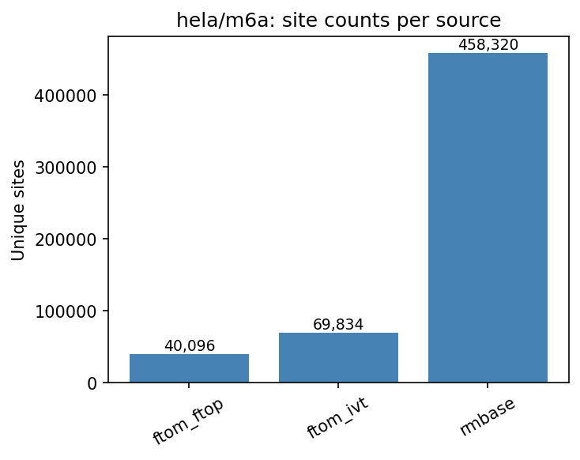
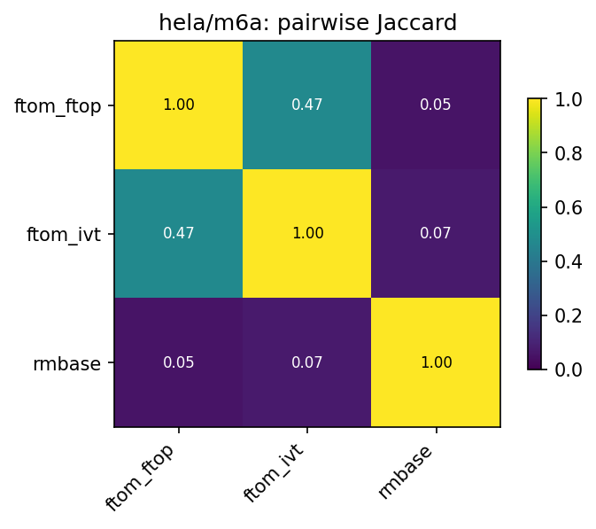
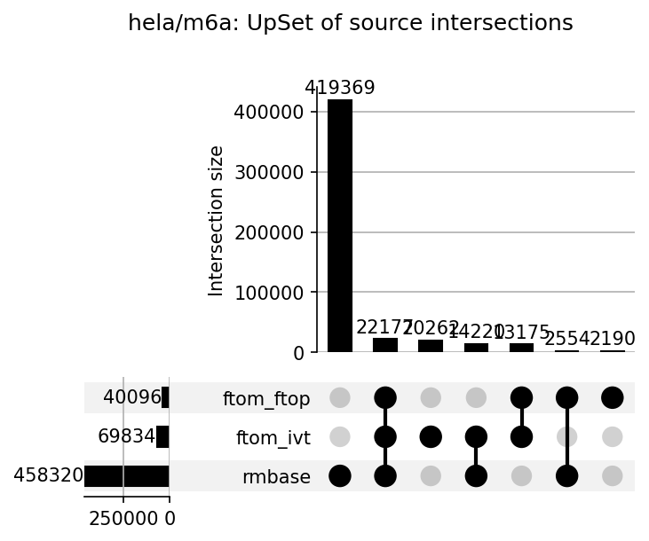

# hela/m6a

HELA N6-methyladenosine (m6A) benchmark datasets.
All TSV files share standardized first 5 columns: `chr`, `start`, `end`, `strand`, `label`.

## Sources

| File | Sites | Label | Description |
|---|---|---|---|
| `ftom_ftop_genome.tsv` | 40,096 | NA (called positives) | GSE211303 FTOm vs FTO+ control, rep1 |
| `ftom_ivt_genome.tsv` | 69,834 | NA (called positives) | GSE211303 FTOm vs IVT control, rep1 |
| `rmbase_genome.tsv` | 458,320 | NA (positive-only) | RMBase v3 HeLa-filtered m6A sites |

## Figures







## Pairwise overlap

Site key: `(chr, start, end, strand)`. Jaccard = |A ∩ B| / |A ∪ B|.

| A | B | |A∩B| | Jaccard | |A∩B|/|A| | |A∩B|/|B| |
|---|---|---|---|---|---|
| ftom_ftop | ftom_ivt | 35,352 | 0.4740 | 0.882 | 0.506 |
| ftom_ftop | rmbase | 24,731 | 0.0522 | 0.617 | 0.054 |
| ftom_ivt | rmbase | 36,397 | 0.0740 | 0.521 | 0.079 |

## Regenerating

```bash
python analyze_overlap.py   # from repo root
```
